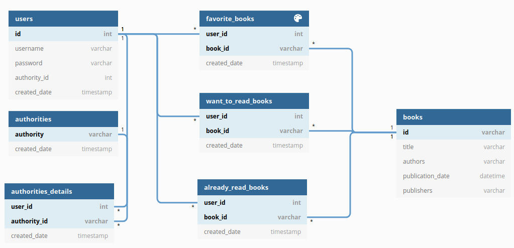
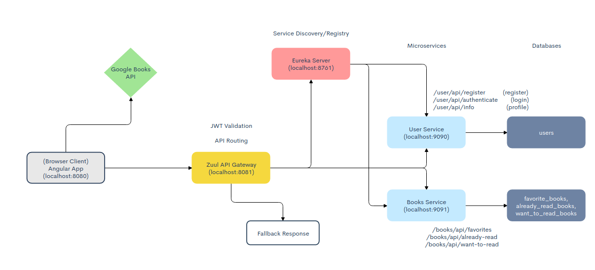

# Book Tracker Microservices App

## Table of Contents

- Objective
- Tools & Technologies Used
- Database Schema
- Microservice Architecture
- Project
- Testing
- Conclusion

## Objective

 
    To build a simple proof of concept microservice app that allows a user to track their favorite books, books they have read, and want to read.

## Tools & Technologies Used

- [Spring Boot](https://spring.io/projects/spring-boot) (takes an opinionated view to make easy to create stand-alone, production-grade Spring based apps that you can "just run")
- [Spring Cloud](https://spring.io/projects/spring-cloud) (provides tools for developers to quickly build some of the common patterns in distributed systems (eg. service discovery, circuit breakers, routing, and more)
  - [Zuul Gateway](https://docs.spring.io/spring-cloud-netflix/docs/2.2.4.RELEASE/reference/html/#router-and-filter-zuul) (a JVM-based router and server-side load balancer from netflix)
  - [Eureka - Service Discovery Server & Client](https://docs.spring.io/spring-cloud-netflix/docs/2.2.4.RELEASE/reference/html/#service-discovery-eureka-clients) (service registration & discovery from netflix)
- [Spring Security](https://spring.io/projects/spring-security) (a framework that focuses on providing both authentication and authorization to Java applications)
- [Angular 10](https://angular.io) (a framework and development platform for creating efficient and sophisticated single-page apps)
- [JWT](https://jwt.io/introduction/) (a compact and self-contained way for securely transmitting information between parties as a JSON object)
- [Docker](https://www.docker.com/)

## Database Schema

    <b>User & Book</b>  
    There is a <b>many to many</b> relationship between users & books.  
    Each user can read many books, and each book can be read by many users. As a result, there is a joing table  for each list (favorite_books, want_to_read_books, & already_read_books).
    Each list has a composite primary key consisting of two columns, foreign key user_id and foreign key book_id. In other words, each row in the favorite_books, want_to_read_books, & already_read_books tables will be uniquely identified by both the user_id and book_id. 

    <b>User & Authority</b>  
    There is a <b>many to many</b> relationship between users and authority (ex: ROLE_ADMIN, ROLE_USER).  
    Each user can have many authorities and each authority can belong to many users. As a result, there is a joining table to keep track of the authority details.
    The <b>authority_details</b> table has a composite primary key consisting of two foreign keys user_id & authority_id. In other words, each row is uniquely identified by user_id & authority_id. 

## Microservice Architecture

## Project

## Testing

## Conclusion
